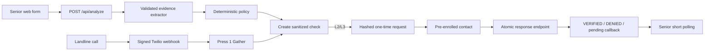

# Architecture

The runnable demo uses an in-memory, server-only repository. The production
boundary is the Supabase schema and atomic token function in `supabase/`.

Evidence extraction cannot select a level or state. Policy cannot consume
tokens. Only server repositories may transition a PENDING check to a terminal
state. The service-role client imports `server-only`.

The demo link appears in the browser only as an explicitly labeled hackathon
delivery channel. Production must deliver it directly to the enrolled
destination.

## Repository mode

All API handlers depend on the interfaces in
`src/lib/repository/contracts.ts`. They do not import the process-local store or
Supabase directly.

`CIRCLECHECK_REPOSITORY_MODE` must be set explicitly:

- `demo` selects the process-local implementation. It is non-durable and meant
  only for local demonstrations and automated tests.
- `supabase` selects the production implementation. If that implementation or
  its required configuration is unavailable, startup/request handling fails
  closed. Production never silently falls back to process-local memory.

Repository reads are divided into public-safe and privileged methods. Public
check reads omit household identifiers, evidence storage internals, contact
destinations, verification token hashes, and raw evidence spans. Demo mode also
rejects requests for household IDs other than its explicitly configured demo
household.

## Enrollment destination verification

Destination verification (CC-202) is a separate subsystem from request
verification with its own table (`enrollment_verifications`), its own
purpose-bound token hashing, its own repository (`enrollmentVerifications`), and
its own API namespace (`/api/enrollment/*`). A request-verification token can
never satisfy an enrollment check and vice versa. A destination becomes verified
only by single-use consumption of a short-lived, hashed secret inside the trusted
server boundary; any failure leaves it unverified. See
`docs/enrollment-verification.md` for the token lifecycle, data handling, and
demo-mode rules.

## Notification delivery

The provider-neutral notification service (CC-203) delivers enrollment secrets
over pluggable SMS/email adapters. It depends only on a `NotificationProvider`
interface and a sanitized payload type, applies bounded exponential backoff with
idempotent retries, and logs only coarse redacted fields. Crucially, delivery is
separate from identity: `DELIVERED` is never `CONFIRMED` or `VERIFIED`, and a
delivery failure leaves the check `PENDING` with manual callback guidance. See
`docs/notification-architecture.md`.
