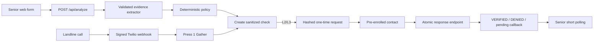

# Architecture

The runnable demo uses an in-memory, server-only repository. The production
boundary is the Supabase schema and atomic token function in `supabase/`.

Evidence extraction cannot select a level or state. Policy cannot consume
tokens. Only server repositories may transition a PENDING check to a terminal
state. The service-role client imports `server-only`.

The demo link appears in the browser only as an explicitly labeled hackathon
delivery channel. Production must deliver it directly to the enrolled
destination.

## Repository mode

All API handlers depend on the interfaces in
`src/lib/repository/contracts.ts`. They do not import the process-local store or
Supabase directly.

`CIRCLECHECK_REPOSITORY_MODE` must be set explicitly:

- `demo` selects the process-local implementation. It is non-durable and meant
  only for local demonstrations and automated tests.
- `supabase` selects the production implementation. If that implementation or
  its required configuration is unavailable, startup/request handling fails
  closed. Production never silently falls back to process-local memory.

Repository reads are divided into public-safe and privileged methods. Public
check reads omit household identifiers, evidence storage internals, contact
destinations, verification token hashes, and raw evidence spans. Demo mode also
rejects requests for household IDs other than its explicitly configured demo
household.

The Supabase check repository always inserts a check as `PAUSED`. Low-concern
checks remain paused. L2/L3 checks can become `PENDING` only through an injected
transactional verification creator. If that operation is unavailable or fails,
the repository throws and the persisted check remains `PAUSED`; it never returns
a partially created PENDING check.

`create_pending_verification` is the production transition boundary. It locks
the PAUSED check row, verifies the contact belongs to the same household and has
a verified destination, locks that contact row against concurrent reassignment,
rejects an existing active request, inserts only the token hash, and transitions
the check to PENDING in one database transaction. Contact selection is stable by
enrollment time and ID. The function is executable only by the service role;
database policy tests assert both the service-role grant and anonymous denial.

## Runtime and demo boundary

`src/lib/runtime-config.ts` is the sole server-side runtime-mode resolver. Demo
mode requires the exact value `CIRCLECHECK_RUNTIME_MODE=demo` and the demo
repository. Missing, false-like, mixed-case, whitespace-padded, or invalid
values do not enable it. A production-built deployment additionally requires
`CIRCLECHECK_DEMO_DEPLOYMENT=true`; otherwise contradictory production/demo
configuration throws.

Production `/api/analyze` uses a strict schema that cannot contain a demo URL,
raw token, token hash, or verification credential. Explicit demo mode uses a
different strict schema. `/api/demo/reset` checks runtime and same-origin
authorization before constructing a repository or mutating data. The root
server layout renders the persistent accessible demo warning; query parameters,
headers, cookies, and browser storage do not participate in runtime resolution.

The prototype does not yet have production household authentication. Until that
is implemented, Supabase public check reads fail closed unless trusted server
code supplies a household scope. Missing, unknown, and mismatched scopes all
produce the same not-found result and return no household or contact metadata.
## Enrollment destination verification

Destination verification (CC-202) is a separate subsystem from request
verification with its own table (`enrollment_verifications`), its own
purpose-bound token hashing, its own repository (`enrollmentVerifications`), and
its own API namespace (`/api/enrollment/*`). A request-verification token can
never satisfy an enrollment check and vice versa. A destination becomes verified
only by single-use consumption of a short-lived, hashed secret inside the trusted
server boundary; any failure leaves it unverified. See
`docs/enrollment-verification.md` for the token lifecycle, data handling, and
demo-mode rules.
