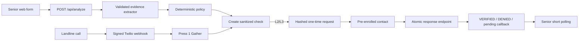

# Architecture

The runnable demo uses an in-memory, server-only repository. The production
boundary is the Supabase schema and atomic token function in `supabase/`.

Evidence extraction cannot select a level or state. Policy cannot consume
tokens. Only server repositories may transition a PENDING check to a terminal
state. The service-role client imports `server-only`.

The demo link appears in the browser only as an explicitly labeled hackathon
delivery channel. Production must deliver it directly to the enrolled
destination.
