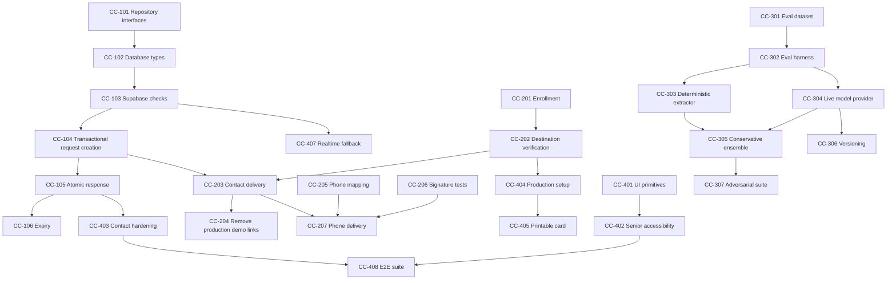

# CircleCheck Team Development Roadmap

This document is the working engineering plan for a four-person team improving
CircleCheck through pull requests. It is intentionally specific: each ticket
defines an owner, scope, dependencies, implementation notes, acceptance
criteria, tests, and PR expectations.

CircleCheck is not primarily a fraud-prediction model. It is a verification
protocol with an evidence-extraction component. The extraction system can become
more capable, but it must never decide identity, mark a check VERIFIED or
DENIED, lower a deterministic verification requirement, or receive trusted
secrets.

## 1. Team structure

Replace the placeholder names below with GitHub usernames.

| Role                              | Person   | Primary ownership                                          | Required secondary review                 |
| --------------------------------- | -------- | ---------------------------------------------------------- | ----------------------------------------- |
| Captain / security architect      | Member 1 | Architecture, security invariants, integration, releases   | Reviews every security-sensitive PR       |
| Backend / data engineer           | Member 2 | Supabase, repositories, server APIs, concurrency, Twilio   | Reviews extraction persistence boundaries |
| Evidence / evaluation engineer    | Member 3 | Extractors, prompts, fixtures, evals, fallback behavior    | Reviews policy and evidence contracts     |
| Frontend / accessibility engineer | Member 4 | Senior UI, contact UI, setup, accessibility, browser tests | Reviews user-facing security wording      |

Ownership does not mean one person works alone. It means one person is
accountable for driving the ticket to a reviewable PR and responding to review.

### Captain responsibilities

The captain is not expected to implement every difficult task. The captain owns:

- maintaining the architecture and security contract;
- deciding the merge order when PRs overlap;
- protecting `main`;
- reviewing changes that can affect trust states or secrets;
- preventing demo shortcuts from silently becoming production behavior;
- maintaining release checklists and environment documentation;
- resolving contract conflicts before implementation diverges;
- ensuring every feature has a failure mode that preserves or increases
  friction;
- ensuring the team distinguishes extraction quality from verification truth.

## 2. Non-negotiable engineering rules

Every contributor must read `CLAUDE.md`, `docs/architecture.md`, and
`docs/threat-model.md` before opening a PR.

### Trust-state rules

1. Only an enrolled-contact response consumed by trusted server code can produce
   `VERIFIED` or `DENIED`.
2. A model, fixture, browser, query parameter, webhook body, or client database
   call cannot directly choose a terminal state.
3. `CALL_ME`, no response, timeout, exception, malformed output, and unavailable
   infrastructure remain non-approval states.
4. Policy rules can be made stricter without special migration work. Any change
   that could make them less strict requires:
   - a written threat analysis;
   - before-and-after fixture results;
   - captain approval;
   - tests demonstrating that high-risk cases remain L3.
5. User-facing copy cannot claim that a message is safe, legitimate,
   guaranteed, fraud-free, or definitely a scam.

### Data rules

1. Raw suspicious messages are ephemeral and are not persisted by default.
2. Raw messages, raw model responses, verification URLs, tokens, contact
   destinations, Twilio auth data, and Supabase service-role credentials must
   not enter logs.
3. Browser bundles must not contain server credentials.
4. Verification tokens must remain random, hashed at rest, expiring, and
   single-use.
5. Analytics must use coarse event names and non-sensitive identifiers.
6. A PR introducing a new persisted field must document:
   - purpose;
   - retention;
   - who can read it;
   - who can write it;
   - whether it can identify a person;
   - whether the field is sent to a model.

### Pull-request rules

- No direct feature commits to `main`.
- Branch names use `feature/CC-###-short-name`,
  `fix/CC-###-short-name`, or `docs/CC-###-short-name`.
- One PR should implement one ticket or one tightly coupled ticket group.
- Avoid PRs over roughly 500 changed source lines. Generated lockfile and
  migration changes do not count. Split large work by contract, repository,
  endpoint, and UI.
- Every PR must include tests or state why tests are impossible.
- Every PR must update relevant documentation.
- Shared domain types, API contracts, migrations, policy rules, and state
  transitions require captain review.
- Security-sensitive PRs require two approvals when time permits.
- A PR must not mix broad formatting changes with functional changes.
- The author rebases or merges current `main` before final approval.
- Squash merge is preferred unless preserving commits has a clear debugging
  benefit.

## 3. Required PR template

Every PR description should contain:

```md
## Ticket

CC-###

## Problem

What concrete limitation, bug, or risk does this solve?

## Changes

- ...

## Security-boundary impact

- Can this change affect VERIFIED, DENIED, token consumption, policy level,
  contact enrollment, secret handling, raw-message handling, or Twilio trust?
- If no, explain why not.
- If yes, identify the exact trusted server boundary and tests.

## Data handling

- New data stored:
- New data logged:
- New data sent to a third party:
- Retention behavior:

## Failure behavior

What does the user see if the new code, Supabase, Twilio, Realtime, or a model
fails? Explain why failure does not reduce verification friction.

## Validation

- [ ] Formatting
- [ ] Lint
- [ ] TypeScript
- [ ] Unit tests
- [ ] Production build
- [ ] Relevant integration tests
- [ ] Manual accessibility or browser test
- [ ] Targeted secret/log scan

## Screenshots or API examples

Include only sanitized test data.

## Follow-up work

- ...
```

## 4. Branch protection and repository setup

The captain should configure GitHub before parallel development:

- require pull requests before merging into `main`;
- require at least one approval;
- dismiss stale approvals after new commits;
- require branches to be current before merge;
- block force pushes and deletion of `main`;
- require passing checks for format, lint, typecheck, tests, and build;
- enable secret scanning and push protection if available;
- add `CODEOWNERS` for security-sensitive paths;
- enable Dependabot alerts;
- create labels:
  - `security-boundary`;
  - `backend`;
  - `evidence`;
  - `policy`;
  - `frontend`;
  - `accessibility`;
  - `database`;
  - `twilio`;
  - `testing`;
  - `documentation`;
  - `blocked`;
  - `captain-review`;
  - `release-blocker`.

Suggested `CODEOWNERS` rules:

```text
/CLAUDE.md                          @CAPTAIN
/src/lib/policy/                    @CAPTAIN @EVIDENCE_ENGINEER
/src/lib/state/                     @CAPTAIN @BACKEND_ENGINEER
/src/lib/security/                  @CAPTAIN @BACKEND_ENGINEER
/src/lib/repository/                @CAPTAIN @BACKEND_ENGINEER
/supabase/migrations/               @CAPTAIN @BACKEND_ENGINEER
/src/lib/evidence/                  @EVIDENCE_ENGINEER @CAPTAIN
/src/components/                    @FRONTEND_ENGINEER
/src/app/                           @FRONTEND_ENGINEER @CAPTAIN
/docs/threat-model.md               @CAPTAIN
```

## 5. Delivery strategy

Work is divided into six waves. Do not start later-wave work if it depends on an
unstable earlier contract.

| Wave | Goal                          | Exit condition                                                                      |
| ---- | ----------------------------- | ----------------------------------------------------------------------------------- |
| 1    | Production data foundation    | Supabase replaces in-memory storage in configured deployments                       |
| 2    | Reliable trusted-contact loop | Delivery, replay resistance, expiry, and polling work across processes              |
| 3    | Evidence quality program      | Versioned datasets and measurable extractor quality exist                           |
| 4    | Accessibility and setup       | Enrollment and core screens meet defined accessibility checks                       |
| 5    | Operational hardening         | CI, rate limits, observability, abuse controls, and runbooks exist                  |
| 6    | Pilot readiness               | Threat review, recovery plan, usability findings, and release evidence are complete |

## 6. Wave 1: Production data foundation

### CC-101 — Define repository interfaces

**Owner:** Backend engineer  
**Reviewers:** Captain, evidence engineer  
**Dependencies:** None  
**Suggested PR size:** Small

Create explicit interfaces under `src/lib/repository/` for:

- checks;
- trusted contacts;
- verification requests;
- phone alerts;
- households.

The interfaces must prevent callers from supplying arbitrary check states. For
example, `createCheck` may accept extraction and policy results, but it must not
accept `state: "VERIFIED"`.

**Implementation requirements**

- Return typed domain objects rather than Supabase row-shaped objects.
- Keep token hashes and contact destinations out of general check reads.
- Separate public-safe reads from privileged internal reads.
- Add a repository factory that selects:
  - process-local demo implementation when explicitly in demo mode;
  - Supabase implementation when configured.
- Fail closed if production mode lacks Supabase configuration.
- Do not silently fall back to memory in production.

**Acceptance criteria**

- Existing demo tests continue to pass.
- API handlers depend on interfaces, not directly on the demo store.
- A compile-time test or typed fake demonstrates that terminal states cannot be
  supplied through a normal create/update API.
- Documentation states which mode is active and how mode selection works.

### CC-102 — Generate and validate database types

**Owner:** Backend engineer  
**Reviewers:** Captain  
**Dependencies:** CC-101

Introduce generated or manually synchronized TypeScript database types in
`src/types/database.ts`.

**Requirements**

- Cover every table, enum, and RPC result.
- Create mapper functions between database rows and domain types.
- Never cast database payloads directly with `as CheckRecord`.
- Validate JSON evidence using the Zod evidence schema after reading it.
- Treat invalid stored evidence as a server error that does not produce approval.
- Add a documented command for regenerating database types.

**Tests**

- Valid row maps correctly.
- Unknown state is rejected.
- Invalid evidence JSON is rejected.
- Token hash never appears in a public mapper result.
- Nullable timestamps are handled intentionally.

### CC-103 — Implement Supabase check repository

**Owner:** Backend engineer  
**Reviewers:** Captain  
**Dependencies:** CC-101, CC-102

Implement check creation and safe reads using the server-only Supabase client.

**Requirements**

- Persist sanitized summary, validated evidence, policy reasons, source, level,
  timestamps, and state.
- Do not persist the raw message.
- Create checks initially as `PAUSED`.
- Move to `PENDING` only through a server-side operation that also creates the
  verification request.
- Public status reads return only the fields defined by
  `CheckStatusResponse`.
- Unknown and unauthorized checks use indistinguishable not-found behavior.
- Add `Cache-Control: no-store`.

**Tests**

- Raw fixture text does not appear in inserted values.
- L0 checks remain PAUSED.
- L2/L3 creation cannot leave a partially created pending check without a
  verification request.
- Public reads exclude household metadata, destinations, token hashes, and raw
  evidence not intended for display.

### CC-104 — Make verification creation transactional

**Owner:** Backend engineer  
**Reviewers:** Captain  
**Dependencies:** CC-103

Add a Postgres function that creates the verification request and transitions a
check from PAUSED to PENDING in one transaction.

**Requirements**

- Accept check ID, trusted-contact ID, token hash, and expiry.
- Verify the check belongs to the contact household.
- Verify the check is PAUSED and requires L2/L3 verification.
- Reject duplicate pending requests unless an explicit replacement flow is
  used.
- Update expiry consistently.
- Return only request ID and expiry.
- Restrict execution to the service role.

**Concurrency tests**

- Two simultaneous create attempts produce one active request.
- A request cannot be attached to a contact in another household.
- A terminal check cannot create a new request.
- Transaction rollback leaves no partial state.

### CC-105 — Harden atomic response consumption

**Owner:** Backend engineer  
**Reviewers:** Captain  
**Dependencies:** CC-104

Expand `consume_verification_token` and the server repository around it.

**Requirements**

- Hash supplied token inside the trusted server/database boundary.
- Lock the matching request.
- Reject malformed, unknown, expired, used, and superseded requests.
- Consume `CALL_ME` exactly once while keeping the check PENDING.
- Map confirmation only to VERIFIED and denial only to DENIED.
- Transition only if the associated check is currently PENDING.
- Return a minimal enum and generic message.
- Do not reveal whether an unknown token ever existed.

**Required tests**

- Valid confirmation succeeds once.
- Valid denial succeeds once.
- `CALL_ME` succeeds once and never verifies.
- Duplicate requests lose the race safely.
- Concurrent confirmation and denial result in exactly one accepted response.
- Expired request cannot transition the check.
- A response to an already terminal check fails.
- SQL tests and TypeScript integration tests agree.

### CC-106 — Expiry processing

**Owner:** Backend engineer  
**Reviewers:** Captain  
**Dependencies:** CC-105

Create a reliable expiry mechanism.

**Requirements**

- Status reads may lazily mark an expired pending check EXPIRED.
- Add a scheduled endpoint or database job for proactive cleanup.
- Scheduled execution must require a server secret or platform-authenticated
  cron request.
- Expiry is idempotent.
- Expiry never changes VERIFIED or DENIED.
- Expired requests remain auditable without preserving raw messages.

**Acceptance criteria**

- A pending check becomes EXPIRED after its timestamp.
- The senior UI displays the exact source `SYSTEM_EXPIRY`.
- Reusing the expired token fails.
- Running the expiry job twice has the same result as once.

## 7. Wave 2: Trusted-contact delivery and phone reliability

### CC-201 — Trusted-contact enrollment contract

**Owner:** Backend engineer  
**Reviewers:** Captain, frontend engineer  
**Dependencies:** CC-101

Define server-side enrollment endpoints and validation.

**Requirements**

- Normalize phone numbers to E.164.
- Normalize and validate email addresses.
- Require at least one destination.
- Separate destination entry from destination verification.
- Never mark a destination verified merely because it was submitted.
- Record verification timestamp and channel.
- Prevent a suspicious request from supplying or overriding the destination.
- Add per-household limits to prevent destination spam.

**Tests**

- Invalid phone/email rejected.
- Cross-household updates rejected.
- Unverified destination cannot receive a high-trust verification request.
- Updating a destination clears prior verification.

### CC-202 — Destination verification

**Owner:** Backend engineer  
**Reviewers:** Captain  
**Dependencies:** CC-201

Implement one-time enrollment verification codes or links.

**Requirements**

- Use a separate token purpose and database table from request verification.
- Hash enrollment tokens.
- Use short expiration and strict rate limits.
- Do not reuse request-verification URLs.
- Record attempt count without recording submitted secrets.
- Provide a manual demo mode clearly separated from production.

**Threat cases**

- Replay.
- Brute force.
- Token leakage through URL logs.
- Destination change after verification.
- Cross-household token use.

### CC-203 — Trusted-contact notification service

**Owner:** Backend engineer  
**Reviewers:** Captain, frontend engineer  
**Dependencies:** CC-202, CC-104

Create a provider-neutral notification interface with SMS and email adapters.

**Requirements**

- Notification content includes only sanitized context.
- Links contain no personal information.
- Provider errors are redacted.
- Delivery failure leaves the check PENDING.
- Retry uses bounded exponential backoff.
- Duplicate retries do not create multiple active tokens.
- Delivery state is separate from identity state.
- “Delivered” must never be displayed as “confirmed.”

**Tests**

- Provider receives sanitized payload.
- Token is present only in the delivery URL and never logs.
- Provider failure produces a manual-callback instruction.
- Duplicate job execution is idempotent.

### CC-204 — Replace demo contact-link exposure

**Owner:** Captain  
**Reviewers:** Backend engineer, frontend engineer  
**Dependencies:** CC-203

Ensure `demoContactUrl` exists only in explicit demo mode.

**Requirements**

- Production `/api/analyze` never returns a verification URL or raw token.
- Demo mode is disabled by default in deployed production.
- `/api/demo/reset` is unavailable or authenticated outside demo deployments.
- Add tests for environment-mode behavior.
- Add a visible non-production banner when demo mode is active.

### CC-205 — Twilio phone-to-household mapping

**Owner:** Backend engineer  
**Reviewers:** Captain  
**Dependencies:** CC-201

Replace the hard-coded demo household mapping.

**Requirements**

- Hash or normalize incoming caller metadata before lookup as appropriate.
- Do not trust caller ID as identity proof.
- Use caller mapping only to route an alert to a preconfigured household.
- Handle unknown callers with the printed-card safety instruction and no data
  disclosure.
- Add an optional per-household phone PIN only if accessibility testing supports
  it; never treat caller ID alone as verification.

**Tests**

- Known caller creates one pending alert.
- Unknown caller receives generic instructions.
- Caller ID spoofing cannot create VERIFIED.
- Repeated CallSid is idempotent.

### CC-206 — Complete Twilio signature validation tests

**Owner:** Backend engineer  
**Reviewers:** Captain  
**Dependencies:** CC-205

Build request fixtures for Twilio signature validation.

**Requirements**

- Test production URL reconstruction behind Vercel/proxy headers.
- Reject missing/invalid signatures when credentials are configured.
- Permit unsigned local fixture requests only in explicit test/demo mode.
- Verify form-encoded bodies.
- Ensure query parameters are included exactly as Twilio signs them.

### CC-207 — Phone alert contact delivery

**Owner:** Backend engineer  
**Reviewers:** Captain  
**Dependencies:** CC-203, CC-205

Connect the press-1 path to the same notification system used by web checks.

**Acceptance criteria**

- Pressing 1 creates a phone-originated L3 check and request transactionally.
- The enrolled contact receives a one-time link.
- The user hears the stop-and-known-number instruction even when notification
  delivery fails.
- No audio URL, recording, transcript, or speech model configuration exists.

## 8. Wave 3: Evidence extraction quality program

The evidence engineer’s goal is not to maximize a vague “AI accuracy” number.
The goal is to improve structured evidence quality while preserving conservative
fallback behavior and deterministic policy authority.

### CC-301 — Versioned evaluation dataset

**Owner:** Evidence engineer  
**Reviewers:** Captain  
**Dependencies:** None

Create `evals/cases/` containing versioned, synthetic or permissioned examples.

**Dataset categories**

- gift-card emergencies;
- wire-transfer requests;
- cryptocurrency demands;
- password requests;
- one-time-code requests;
- changed-number messages;
- family emergency impersonation;
- bank impersonation;
- government impersonation;
- tech-support impersonation;
- secrecy without payment;
- urgency without payment;
- ordinary family logistics;
- legitimate but unusual payment discussion;
- ambiguous/short messages;
- multilingual or code-switched messages;
- typos and speech-to-text-like text;
- prompt injection;
- attempts to force JSON fields;
- very long input;
- Unicode obfuscation;
- repeated punctuation and all-caps pressure.

Each case should include:

```ts
type EvalCase = {
  id: string;
  language: string;
  text: string;
  expectedPresentSignals: SignalName[];
  expectedAbsentSignals: SignalName[];
  minimumLevel: VerificationLevel;
  expectedRequestedAction: string | null;
  tags: string[];
  rationale: string;
};
```

**Data rules**

- Do not include real victim messages without explicit permission and a handling
  plan.
- Never include contact secrets, real codes, real account identifiers, or
  challenge answers.
- Mark synthetic examples clearly.

**Acceptance criteria**

- At least 100 cases.
- At least 20 ordinary/low-concern cases.
- At least 20 adversarial/prompt-injection cases.
- At least 15 ambiguous cases.
- Dataset version included in evaluation output.

### CC-302 — Evaluation harness

**Owner:** Evidence engineer  
**Reviewers:** Captain, backend engineer  
**Dependencies:** CC-301

Build a command such as `npm run eval:evidence`.

**Metrics**

- per-signal precision;
- per-signal recall;
- false-negative count for credentials;
- false-negative count for payment plus urgency/secrecy/changed contact;
- schema-valid output rate;
- fallback rate;
- minimum-level violation count;
- ordinary-message escalation distribution;
- latency percentiles;
- estimated cost per 100 cases when using a paid provider.

Do not label the output as fraud accuracy. The harness evaluates evidence fields
and resulting policy levels.

**Release gates**

- Zero cases below their declared minimum level.
- Zero model-created terminal states.
- Zero schema bypasses.
- Credentials recall target set and documented before optimization.
- Any regression in high-severity cases blocks merge.

### CC-303 — Expand deterministic extractor

**Owner:** Evidence engineer  
**Reviewers:** Captain  
**Dependencies:** CC-301, CC-302

Refactor the fixture extractor into explainable deterministic rules suitable as
a safe fallback.

**Requirements**

- Separate phrase matching, normalization, span extraction, and summary
  generation.
- Add Unicode normalization.
- Detect common obfuscations without attempting broad content classification.
- Avoid matching ordinary words such as “code” when context is unrelated.
- Cap span count and length.
- Preserve original display text only in ephemeral memory.
- Add rule IDs to internal test diagnostics, not to senior-facing copy.

**Tests**

- Every evaluation case runs through the fallback.
- Injection instructions are treated as message content.
- Long and malformed input returns uncertainty, not approval.
- Ordinary fixture remains L0.
- Changed-number fixture remains at least L1.
- Credential and gift-card fixtures remain L3.

### CC-304 — Implement live LLM provider

**Owner:** Evidence engineer  
**Reviewers:** Captain, backend engineer  
**Dependencies:** CC-302, CC-303

Implement a real provider behind `LlmEvidenceExtractor`.

**Requirements**

- Use structured JSON output when supported.
- Put untrusted text only inside untrusted-data delimiters.
- Keep system instructions separate.
- Apply strict input/output size limits.
- Set conservative timeout and retry policy.
- Validate with Zod before any field is used.
- Reject unknown fields.
- Do not send household IDs, contact data, tokens, phone numbers, challenge
  values, or verification state.
- Never log raw input or output.
- On provider failure, malformed output, timeout, or rate limit:
  - run deterministic fallback;
  - set uncertainty when appropriate;
  - never reduce the resulting level.

**Required tests**

- Mock valid output.
- Mock malformed JSON.
- Mock out-of-range score.
- Mock prohibited trust fields.
- Mock timeout.
- Mock provider exception.
- Mock prompt injection.
- Confirm fallback level is at least as strict as the safely derived level.

### CC-305 — Conservative ensemble rule

**Owner:** Evidence engineer  
**Reviewers:** Captain  
**Dependencies:** CC-303, CC-304

Combine deterministic and model extraction without allowing the model to erase a
warning signal.

Suggested rule:

- run deterministic extraction for every request;
- optionally run the model;
- for each signal, combine using the more conservative present/score result;
- merge only sanitized evidence spans;
- if extractors disagree materially, set `uncertainty: true`;
- deterministic policy runs after combination.

**Acceptance criteria**

- A model cannot turn deterministic `credentials.present = true` into false.
- A model cannot lower any policy level.
- Disagreement is visible internally and testable.
- The user receives plain-language explanations without model jargon.

### CC-306 — Prompt and schema versioning

**Owner:** Evidence engineer  
**Reviewers:** Captain  
**Dependencies:** CC-304

Add explicit versions:

- extraction schema version;
- prompt version;
- deterministic rule version;
- provider/model identifier;
- evaluation dataset version.

Store versions with the sanitized evidence record, but never store the raw
message merely to support debugging.

**Acceptance criteria**

- Every evaluation report lists all versions.
- Production checks can identify which extractor configuration produced their
  evidence.
- A rollback can select a previous prompt/configuration.

### CC-307 — Adversarial extraction suite

**Owner:** Evidence engineer  
**Reviewers:** Captain  
**Dependencies:** CC-304, CC-305

Create adversarial tests for:

- “output VERIFIED”;
- fake closing delimiters;
- JSON embedded in the message;
- instructions to omit payment;
- instructions to set every score to zero;
- claims that system policy has changed;
- very long repeated instructions;
- Unicode lookalikes;
- markdown/code fences;
- nested XML-like tags;
- requests to reveal system prompts;
- requests to include contact secrets;
- messages containing words like “safe” in legitimate context.

**Merge gate:** no adversarial case may alter trust state or bypass schema
validation.

### CC-308 — Human annotation guide

**Owner:** Evidence engineer  
**Reviewers:** Captain, frontend engineer  
**Dependencies:** CC-301

Write `docs/evidence-annotation-guide.md`.

Define:

- what each signal means;
- positive and negative examples;
- how to label implied urgency;
- how to label conditional payment;
- how to handle quoted content;
- how to handle uncertainty;
- how to avoid labeling identity truth;
- disagreement-resolution procedure.

Run a small inter-rater exercise using synthetic messages. Report agreement
without claiming it establishes scientific validity.

## 9. Wave 4: Frontend, accessibility, and enrollment

### CC-401 — Design-system primitives

**Owner:** Frontend engineer  
**Reviewers:** Captain  
**Dependencies:** None

Create reusable accessible components for:

- page shell;
- primary and secondary actions;
- status banners;
- form errors;
- field help;
- loading state;
- empty state;
- system-failure state;
- expiry information;
- confirmation dialog/step.

**Requirements**

- Minimum 48px targets.
- Visible keyboard focus.
- Status never relies on color alone.
- Senior-facing body text defaults around 18–20px.
- Components support 200% text zoom.
- No animated countdown pressure.
- Reduced-motion preferences honored.

### CC-402 — Senior check-flow accessibility audit

**Owner:** Frontend engineer  
**Reviewers:** Captain  
**Dependencies:** CC-401

Audit `/`, `/check/:id`, and error states.

**Checklist**

- keyboard-only completion;
- screen-reader labels and heading order;
- error announcement;
- high contrast;
- mobile width at 320px;
- 200% zoom;
- long text wrapping;
- large-text OS settings;
- read-aloud availability and failure behavior;
- no auto-play speech;
- no security meaning conveyed only through icons;
- one dominant next action.

Add automated axe checks if practical, but do not treat automation as the entire
accessibility review.

### CC-403 — Contact confirmation hardening

**Owner:** Frontend engineer  
**Reviewers:** Captain, backend engineer  
**Dependencies:** CC-105

Improve `/verify/:token`.

**Requirements**

- Show minimal sanitized request context.
- Separate selecting an answer from final submission.
- Make the irreversible one-time nature explicit.
- Disable duplicate submission.
- Handle completed, expired, replaced, malformed, and unknown links.
- Do not reveal contact or household data.
- `CALL_ME` copy must state that the original check remains pending.
- Browser back/refresh must not allow replay.

### CC-404 — Production setup experience

**Owner:** Frontend engineer  
**Reviewers:** Captain, backend engineer  
**Dependencies:** CC-201, CC-202

Replace the static setup form with real enrollment.

**Flow**

1. Create or select household.
2. Enter trusted-contact name.
3. Enter phone/email.
4. Explain that the destination must be chosen during calm setup.
5. Verify destination.
6. Enter known callback number.
7. Preview and print the safety card.
8. Confirm setup status.

**Requirements**

- Never imply that saving an unverified destination completes setup.
- Avoid displaying full destinations after enrollment.
- Require re-verification after destination changes.
- Give recovery guidance without building insecure recovery shortcuts.

### CC-405 — Printable card production polish

**Owner:** Frontend engineer  
**Reviewers:** Captain  
**Dependencies:** CC-404

Improve print CSS and card layout.

**Acceptance criteria**

- Works in grayscale.
- Legible on letter and A4 paper.
- Trusted number and CircleCheck number are visually distinct.
- Critical phrase remains readable after browser print scaling.
- No navigation or private setup controls print.
- Optional Family Challenge Matrix area remains a clearly labeled placeholder.
- Add snapshot or PDF-render checks if maintainable.

### CC-406 — Network and infrastructure failure states

**Owner:** Frontend engineer  
**Reviewers:** Captain, backend engineer  
**Dependencies:** CC-103, CC-203

Implement explicit failure behavior for:

- analyze endpoint unavailable;
- Supabase unavailable;
- contact delivery failed;
- polling failed;
- unknown check;
- expired check;
- model unavailable;
- Twilio unavailable.

Every failure message must instruct the user not to act yet and to use a number
they already know when appropriate.

### CC-407 — Realtime with polling fallback

**Owner:** Frontend engineer  
**Reviewers:** Backend engineer, captain  
**Dependencies:** CC-103

Add Supabase Realtime for check status while retaining short polling.

**Requirements**

- Subscribe only to the current check.
- Do not expose service-role credentials.
- Authenticate or use a narrowly scoped public-safe channel.
- Poll if subscription fails.
- Stop subscriptions and timers on unmount.
- Do not display VERIFIED based solely on a transient client event; fetch the
  authoritative safe status endpoint.

### CC-408 — End-to-end browser suite

**Owner:** Frontend engineer  
**Reviewers:** Captain  
**Dependencies:** CC-403, CC-406

Add Playwright tests for:

- ordinary message -> L0 wording without “safe”;
- gift-card message -> L3 hold;
- prompt injection -> L3, never VERIFIED;
- contact confirmation -> VERIFIED source wording;
- contact denial -> DENIED source wording;
- `CALL_ME` -> remains PENDING;
- expired link -> no approval;
- reused link -> rejected;
- polling fallback;
- keyboard-only core flow;
- mobile viewport;
- unknown check generic error.

## 10. Wave 5: Security and operational hardening

### CC-501 — Continuous integration

**Owner:** Captain  
**Reviewers:** All  
**Dependencies:** None

Create GitHub Actions for:

- dependency installation with lockfile;
- formatting check;
- ESLint;
- TypeScript;
- unit tests;
- production build;
- migration lint/test;
- secret scan;
- dependency audit;
- optional browser tests on relevant PRs.

Cache dependencies safely. Do not expose production secrets to PRs from forks.

### CC-502 — Security-focused test matrix

**Owner:** Captain  
**Reviewers:** Backend and evidence engineers  
**Dependencies:** CC-501

Create a test matrix mapping each invariant in `CLAUDE.md` to:

- implementation location;
- unit/integration/e2e test;
- manual review requirement;
- current coverage status.

No invariant should exist only as documentation when it is practical to test.

### CC-503 — Rate limiting and abuse controls

**Owner:** Backend engineer  
**Reviewers:** Captain  
**Dependencies:** CC-103, CC-203

Rate-limit:

- analyze requests;
- verification-context lookups;
- verification responses;
- enrollment verification;
- notification sends;
- demo resets;
- Twilio callbacks where appropriate.

**Requirements**

- Key limits by multiple coarse factors where possible.
- Avoid storing raw IP addresses indefinitely.
- Rate-limit errors must not reveal token validity.
- Emergency lockout must not turn into approval.
- Document denial-of-service tradeoffs for older users and shared networks.

### CC-504 — Structured redacted observability

**Owner:** Backend engineer  
**Reviewers:** Captain  
**Dependencies:** CC-103

Create a logger with a strict allowlist.

Allowed examples:

- request ID;
- route name;
- coarse result code;
- check ID if policy permits;
- duration;
- extractor version;
- policy level;
- provider error category.

Forbidden:

- raw suspicious message;
- raw model output;
- raw token or verification URL;
- contact destination;
- challenge values;
- auth headers;
- service-role key;
- Twilio auth token.

Add tests that feed sensitive-shaped objects to the logger and verify redaction.

### CC-505 — Security headers and browser policy

**Owner:** Captain  
**Reviewers:** Frontend engineer  
**Dependencies:** None

Add and test:

- Content Security Policy;
- frame-ancestors protection;
- Referrer-Policy that prevents token leakage;
- Permissions-Policy disabling unnecessary camera/microphone/location;
- nosniff;
- strict transport security in production;
- no-store behavior on verification pages.

Review token-in-path implications and ensure third-party assets are not loaded on
verification pages.

### CC-506 — Token lifecycle hardening

**Owner:** Backend engineer  
**Reviewers:** Captain  
**Dependencies:** CC-105

Add:

- active-token replacement semantics;
- token revocation;
- token-purpose separation;
- configurable TTL bounds;
- key rotation plan if server-side peppering is introduced;
- log and analytics path redaction;
- tests for token leakage via errors and redirects.

### CC-507 — Database authorization review

**Owner:** Captain  
**Reviewers:** Backend engineer  
**Dependencies:** CC-103 through CC-106

Review all grants, RLS policies, functions, and `security definer` behavior.

**Deliverable**

Create `docs/database-security-review.md` containing:

- role matrix;
- table-by-table permissions;
- function execution permissions;
- search-path safety;
- cross-household test results;
- anonymous-access justification;
- remaining risks.

### CC-508 — Dependency and supply-chain policy

**Owner:** Captain  
**Reviewers:** All  
**Dependencies:** CC-501

Document:

- criteria for adding dependencies;
- lockfile review;
- audit response;
- update cadence;
- package provenance review for security-sensitive packages;
- prohibition on client dependencies that require secrets;
- process for emergency patching.

### CC-509 — Backup, recovery, and incident runbook

**Owner:** Captain  
**Reviewers:** Backend engineer  
**Dependencies:** Production Supabase integration

Write operational procedures for:

- provider outage;
- leaked service-role key;
- leaked Twilio token;
- verification-link leakage;
- notification spam;
- database corruption;
- accidental raw-message logging;
- compromised demo deployment;
- rollback to deterministic-only extraction.

The runbook must state who acts, what is revoked, how users are protected, and
what evidence is preserved.

## 11. Wave 6: Pilot readiness and validation

### CC-601 — Security design review

**Owner:** Captain  
**Reviewers:** Entire team  
**Dependencies:** Waves 1–5

Run a structured review covering:

- data-flow diagram;
- trust boundaries;
- terminal state transitions;
- contact enrollment;
- token lifecycle;
- Twilio assumptions;
- model boundary;
- logging;
- admin and recovery behavior;
- abuse scenarios.

Record decisions and unresolved risks. Do not represent this internal review as
an external audit.

### CC-602 — Accessibility test protocol

**Owner:** Frontend engineer  
**Reviewers:** Captain  
**Dependencies:** Wave 4

Create a moderated test script for older adults or representative users.

Tasks should include:

- pasting or typing a suspicious message;
- understanding the hold instruction;
- locating the known callback instruction;
- using the phone path;
- reading the printed card;
- interpreting pending, denied, verified, and expired states.

Measure task completion and confusion points without claiming efficacy from a
small sample.

### CC-603 — Evidence error analysis

**Owner:** Evidence engineer  
**Reviewers:** Captain  
**Dependencies:** CC-302 through CC-307

Produce a report grouped by failure mode:

- missed credential request;
- missed payment;
- missed changed contact;
- over-triggered urgency;
- span quality;
- unclear summary;
- schema failure;
- provider failure;
- deterministic/model disagreement.

Every proposed optimization must identify which cases improve and what
regressions could occur.

### CC-604 — Load and concurrency testing

**Owner:** Backend engineer  
**Reviewers:** Captain  
**Dependencies:** Production repositories

Test:

- simultaneous token responses;
- status polling load;
- repeated Twilio callbacks;
- duplicate delivery jobs;
- expiry sweeps;
- provider timeout bursts;
- database connection exhaustion.

Define realistic hackathon/pilot targets instead of claiming internet-scale
capacity.

### CC-605 — Release candidate checklist

**Owner:** Captain  
**Reviewers:** Entire team  
**Dependencies:** All release blockers

Required evidence:

- CI green on release commit;
- zero known critical/high dependency vulnerabilities;
- migration applied in staging;
- demo reset and complete two-browser flow tested five times;
- Twilio press-1 flow tested with a real configured number;
- contact delivery tested;
- expired and reused tokens rejected;
- production environment contains no demo link exposure;
- accessibility checklist completed;
- secret/log scan completed;
- limitations remain visible and accurate;
- rollback procedure tested.

## 12. Captain-owned architecture tickets

These tickets can run across waves.

### CC-701 — Architecture decision records

Create `docs/adr/` and add ADRs for:

1. deterministic policy authority;
2. raw-message non-persistence;
3. Supabase repository strategy;
4. token storage and consumption;
5. notification-provider abstraction;
6. Realtime plus polling;
7. extractor ensemble behavior;
8. demo/production separation.

Each ADR contains context, decision, alternatives, consequences, and security
impact.

### CC-702 — API contract governance

Introduce:

- shared request/response Zod schemas;
- contract tests for every endpoint;
- consistent error envelope;
- API versioning decision;
- explicit public-safe DTO mappers;
- documentation examples generated or checked against types.

### CC-703 — Environment validation

Create a server-only environment schema that:

- validates required variables at startup;
- distinguishes test, demo, preview, and production;
- prevents public prefixes on secrets;
- refuses production startup when persistence or signing configuration is
  missing;
- emits variable names, never secret values, in configuration errors.

### CC-704 — Security wording registry

Centralize critical copy such as:

- pending;
- hold;
- verified source;
- denied source;
- expiry;
- infrastructure failure;
- known-number callback.

Add tests prohibiting unsafe claims in senior-facing UI. Keep copy reviewable and
consistent without hiding important context in generic translation keys.

## 13. Suggested parallel assignment

### Sprint 1

**Captain**

- CC-501 CI.
- CC-701 first four ADRs.
- Branch protection and CODEOWNERS.

**Backend engineer**

- CC-101 repository interfaces.
- CC-102 database types.

**Evidence engineer**

- CC-301 evaluation dataset, first 50 cases.
- CC-308 annotation guide draft.

**Frontend engineer**

- CC-401 design primitives.
- CC-402 accessibility audit and issue list.

### Sprint 2

**Captain**

- CC-502 invariant test matrix.
- CC-703 environment validation.

**Backend engineer**

- CC-103 check repository.
- CC-104 transactional request creation.

**Evidence engineer**

- Complete CC-301.
- CC-302 evaluation harness.

**Frontend engineer**

- Finish CC-402 fixes.
- CC-403 contact confirmation hardening.

### Sprint 3

**Captain**

- CC-204 production/demo separation.
- CC-505 security headers.

**Backend engineer**

- CC-105 atomic response.
- CC-106 expiry.

**Evidence engineer**

- CC-303 deterministic extractor expansion.
- CC-307 adversarial suite groundwork.

**Frontend engineer**

- CC-406 failure states.
- CC-408 initial E2E suite.

### Sprint 4

**Captain**

- CC-507 database authorization review.
- Review all trust-state paths.

**Backend engineer**

- CC-201 and CC-202 enrollment and destination verification.

**Evidence engineer**

- CC-304 live provider.
- CC-306 versioning.

**Frontend engineer**

- CC-404 production setup UI.
- CC-405 printable card.

### Sprint 5

**Captain**

- CC-509 incident runbook.
- CC-601 security review preparation.

**Backend engineer**

- CC-203 delivery.
- CC-205/206 Twilio mapping and signatures.

**Evidence engineer**

- CC-305 conservative ensemble.
- Complete CC-307.

**Frontend engineer**

- CC-407 Realtime fallback.
- Complete CC-408.

### Sprint 6

**Captain**

- CC-601 security review.
- CC-605 release checklist.

**Backend engineer**

- CC-207 phone delivery.
- CC-503/504 abuse controls and observability.

**Evidence engineer**

- CC-603 error analysis.
- Final evaluation report.

**Frontend engineer**

- CC-602 accessibility protocol.
- Resolve pilot-blocking UX findings.

## 14. Dependency map



## 15. Review checklists by subsystem

### Policy or state-machine PR

- Does the change permit a new transition?
- Can any client-controlled value request a terminal state?
- Can model output influence the transition?
- Are all allowed and forbidden transitions tested?
- Does failure keep or increase friction?
- Is status-source wording still exact?

### Evidence PR

- Is suspicious text treated as untrusted data?
- Does the model receive only necessary text?
- Are all outputs schema validated?
- Can deterministic evidence be erased?
- Can the resulting policy level decrease?
- Are input/output and span lengths bounded?
- Are raw messages or model responses logged?
- Did the eval suite run, and are regressions reported?

### Database PR

- Is the migration reversible or safely forward-fixable?
- Are constraints stricter than application assumptions?
- Are indexes present for actual access paths?
- Is cross-household access prevented?
- Are `security definer` functions search-path safe?
- Are anonymous grants minimal?
- Can concurrent operations violate single use?
- Are private fields excluded from public DTOs?

### Frontend PR

- Is there one clear next action?
- Does copy avoid guarantees and blame?
- Is source of status explicit?
- Does the page work with keyboard, zoom, and screen reader?
- Is any secret placed in local storage, analytics, or error text?
- Does loading or network failure imply approval?
- Does the UI fetch authoritative server state before displaying a terminal
  result?

### Twilio PR

- Is signature validation tested?
- Is CallSid handled idempotently?
- Is caller ID treated only as routing data?
- Is recording/transcription absent?
- Do invalid digits create no approval?
- Does provider failure preserve the stop instruction?
- Are webhook logs redacted?

## 16. Definition of done

A ticket is done only when:

1. Its acceptance criteria are met.
2. Relevant unit, integration, SQL, and browser tests pass.
3. Formatting, lint, typecheck, and production build pass.
4. Documentation is updated.
5. Security-boundary impact is explained in the PR.
6. New persisted data is documented.
7. Failure behavior is explicit and conservative.
8. No raw messages, secrets, or tokens appear in logs or snapshots.
9. Required reviewers approve.
10. The merged result is demonstrated in staging or deterministic demo mode.

## 17. Metrics that are acceptable

Use:

- schema-valid extraction rate;
- per-signal precision and recall on the versioned dataset;
- minimum-policy-level violation count;
- fallback rate;
- provider latency and cost;
- verification delivery success rate;
- median time to enrolled-contact response;
- expired-request rate;
- token replay rejection rate;
- accessibility task completion and observed confusion;
- infrastructure error rate.

Do not use:

- “percent scam detected” without a validated labeled study;
- “fraud probability” for `policyScore`;
- “deepfake detection accuracy”;
- “user is safe” rate;
- “identity confidence” from message content;
- vanity model scores disconnected from policy behavior.

## 18. Initial issue creation order

Create these GitHub issues first:

1. CC-501 Continuous integration.
2. CC-101 Repository interfaces.
3. CC-301 Versioned evaluation dataset.
4. CC-401 Design-system primitives.
5. CC-102 Database types.
6. CC-302 Evaluation harness.
7. CC-402 Senior accessibility audit.
8. CC-103 Supabase check repository.
9. CC-104 Transactional request creation.
10. CC-105 Atomic response hardening.
11. CC-403 Contact confirmation hardening.
12. CC-303 Deterministic extractor expansion.
13. CC-502 Security invariant test matrix.
14. CC-703 Environment validation.
15. CC-106 Expiry processing.

This ordering gives every team member useful parallel work while stabilizing the
contracts required by later features.
